@title[Title slide]
## Lights on, lights off
#### "switching" cells in the reina
Martha Robinson

---?image=figures/retina_circuit.png&size=auto 90%

@title[Introduction to the retina]
Note:
Just keep on to 3 key ideas:
The retina needs to operate and signal meaningfully over a large range of environmental light levels
The retina has two main classes of input cells: rod and cone photoreceptors, that are specialised to dim light and bright light
Rod pathway is "parasitic" on cone pathway via AII cells.
Classically, retina is thought to be separated into ON and OFF channels, is by receptor expression and by anatomy
Give more background on who you are and where you're coming from and what your skills are, and less on making everyone understand the retina.
I started this work because I was interested in how the rod and the cone pathways interact, particularly in "mesopic" vision where both pathways are active, and how this might be altered in disorders of vision where one or other pathway is absent.

---?image=figures/experimental_outline.png&size=auto 85%

@title[Methods]

---?image=figures/NoSwitchcellegs_WT.png&size=auto 90%
@title[Characterising retinal receptive fields]

Note: 
Scalebar is 200um

---?image=figures/WT_ONOFF_SwitchingCells_EgFilters.png&size=auto 90%
@title[Receptive fields can "switch" with light level]

Note:
Scalebar is 200um

---

@title[Switching occured in 28% of cells]
<p><span class="menu-title slide-title">Switching occured in 28% of cells</span></p>

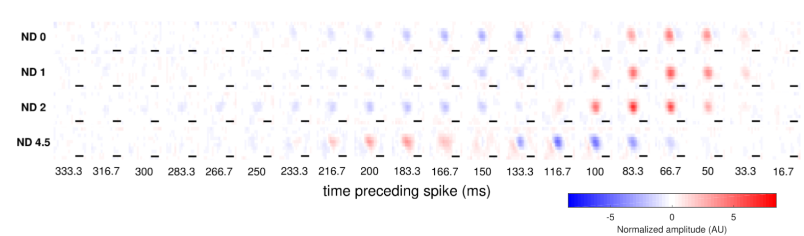
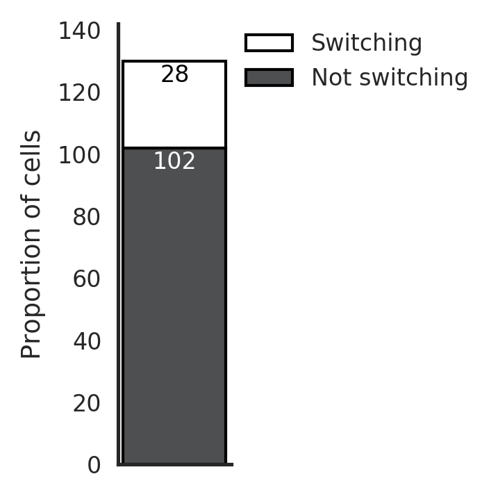
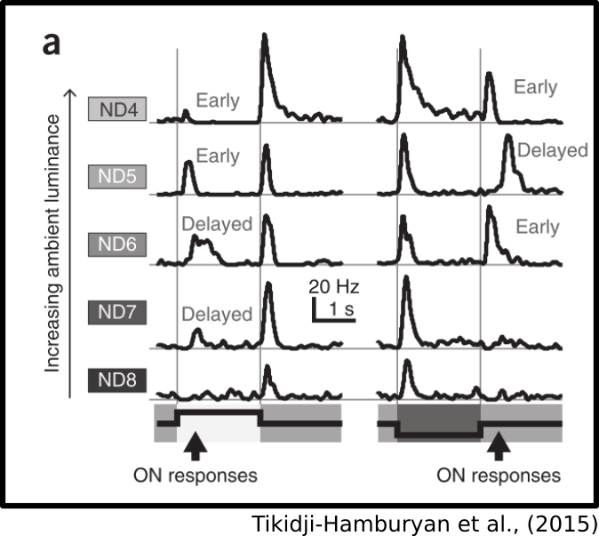

Note:
Scalebar is 200um
Tikidji-Hamburyan (2015) have also seen this
They say: Overall, 89% of the OFF cells changed their responses at least once between ND8 and ND4. And over 50% of the cells they identified as ON did the same.
Maybe also point to other egs of switches in ganglion cells

---

@title[Switching occured between every pair of light levels]
<p><span class="menu-title slide-title">Switching occured between every pair of light levels</span></p>

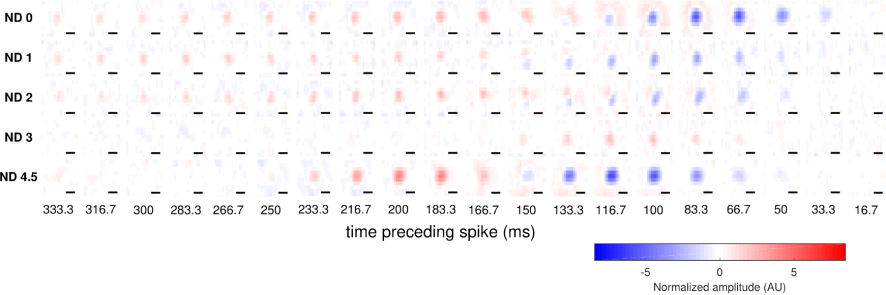
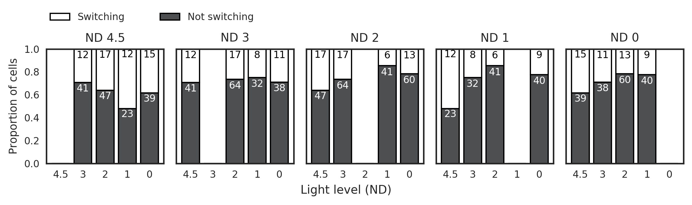

---

@title[One cell can switch multiple times]
<p><span class="menu-title slide-title">One cell can switch multiple times</span></p>

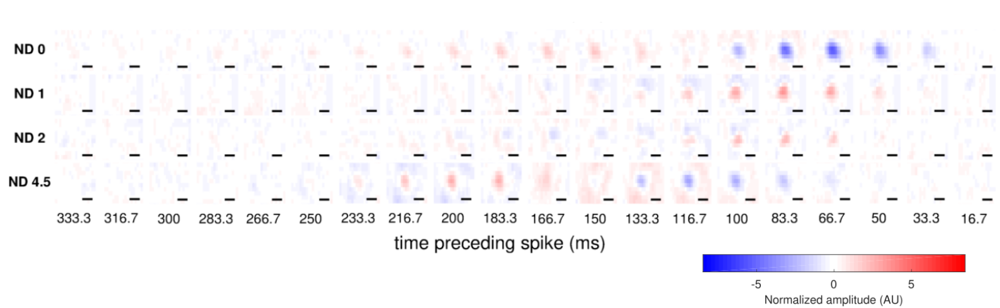
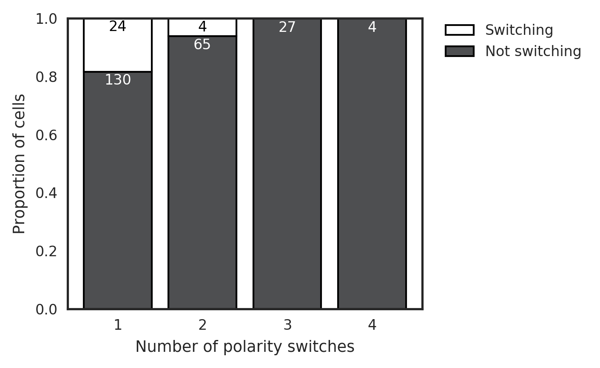

---

@title[Switching is associated with spatial instability]
<p><span class="menu-title slide-title">Switching is associated with spatial instability</span></p>

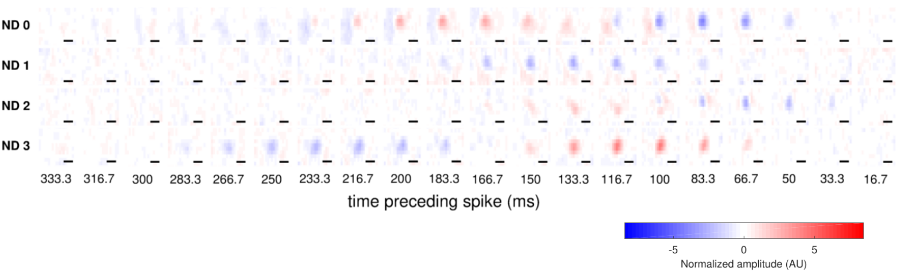


---

@title[Summary]
- Switching was common (28%)
- Swiching occured between every pair of light levels
- One cell can switch multiple times
- Switching is associated with spatial instability

Note:
What mechanism could explain this? 
Why do cells switch polarity?
Really talk about how this seems like a nightmare for downstream neurons - if they care about polarity at all, how do they cope with their input neurons changing polarity seemingly willy-nilly? Can this switching encode something?
---

@title[Switching also occurs at bipolar cell terminals]
<p><span class="menu-title slide-title">Switching also occurs at bipolar cell terminals</span></p>
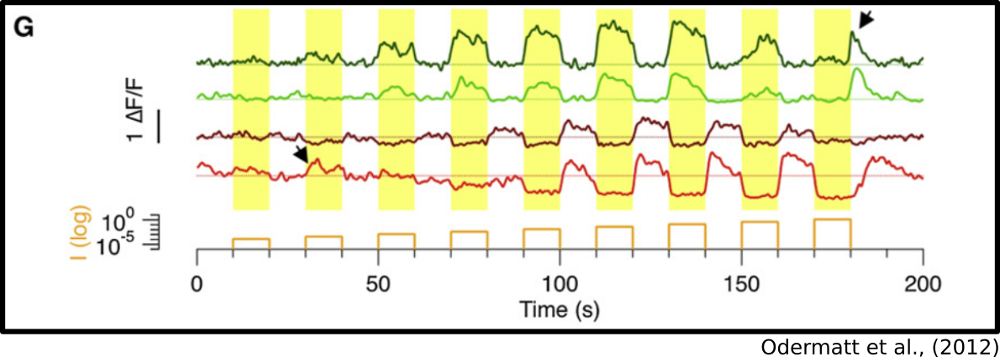
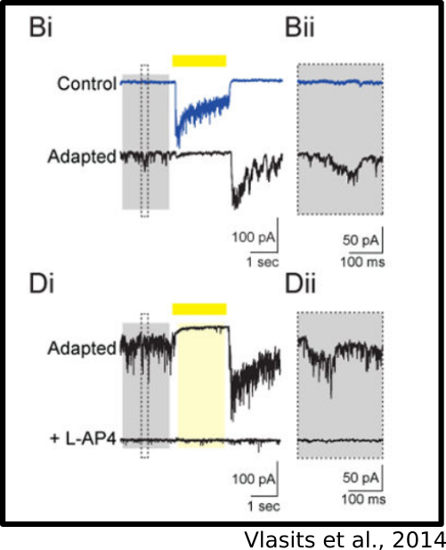

Note:
Odermatt = calcium indicator in bipolar cell terminals - SYGCAMP2 in zebrafish
Vlasits = Individual voltage clamp sweeps at −72 mV holding potential showing the excitatory current during presentation of a 2 s light flash (yellow bar) in an On-SAC before and after repetitive stimulation. Light adaptation causes a switch in the starburst amacrine cell, which is blocked by L-AP4 and therefore driven by an ON bipolar cell.

---

@title[Minimal model of switching]

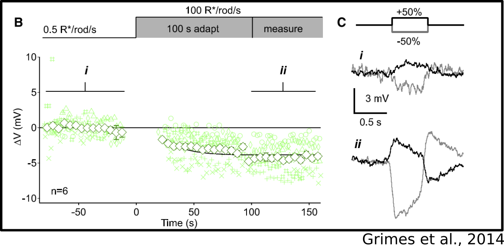
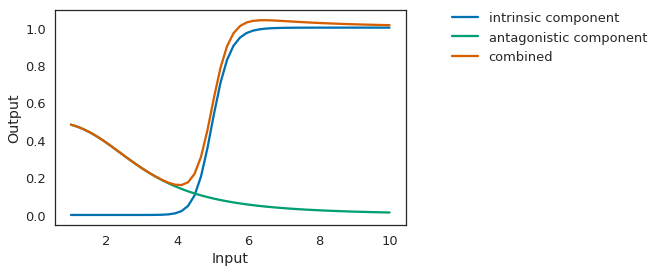

---

@title[Minimal model of switching]
<p><span class="menu-title slide-title">Minimal model of switching</span></p>
```python
def rectifying_terminal_with_gap_junction(
        vprior, input, dt):
    iweight = 0.5 #input weight
    islope = 20.0 #rectifying terminal Hill slope
    ih = 5.0 #rectifying terminal half-saturation point
    aweight = 1.0 #"gap junction" weight 
    aslope = 3.0 #Vm Hill slope
    ah = 3.0 # Vm half-saturation point
    vmweight = 5.0 #scale Vm
    taum = 10.0 #decay time constant
    #weight input for "gap junction"
    gi = input*aweight
    #calcuate the Vm set by "gap junction"
    vm = gi**-aslope/(gi**-aslope + ah**-aslope) 
    #and add the input
    vinf = (vm*vmweight) + (input*iweight)
    #decay the membrane potential back to vm
    vt = vinf + (vprior - vinf)*np.exp(-dt/taum)
    #calculate release using Hill equation (sigmoidal)
    release = vt**islope/(vt**islope + ih**islope)
    #return graded release directly
    return vt, release
```
@[13,14](Resting membrane potential hyperpolarizes with light)
@[15-18](Terminal depolarizes with input, and decays back to Vm like a leaky IF cell)
@[19-22](Release is nonlinearly dependent on volatage)
---
@title[Minimal model of switching]
<p><span class="menu-title slide-title">Minimal model of switching</span></p>
A **rectifying terminal** that **hyperpolarizes with light**
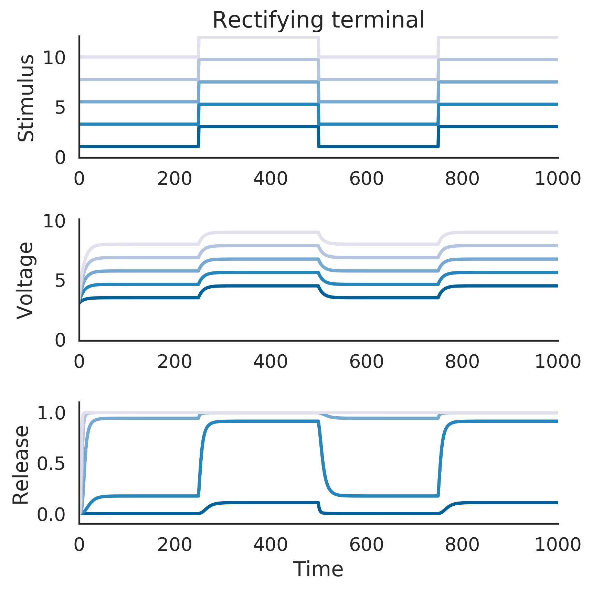
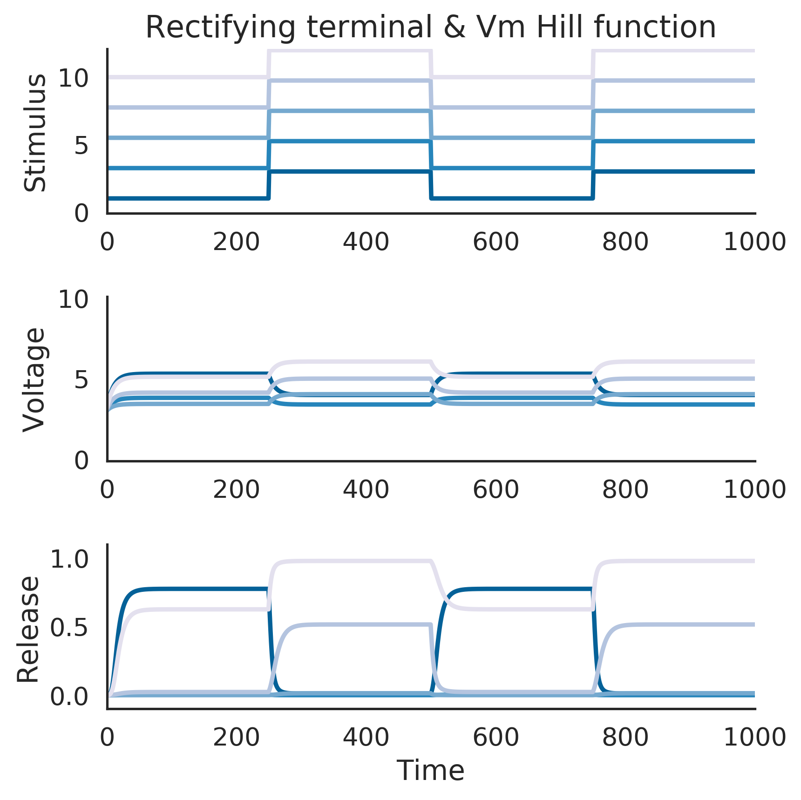

---

@title[Minimal model allows switching between any pair of light levels]

---
@title[Minimal model allows one cell to switch multiple times]

----
@title[Model summary]
<p><span class="menu-title slide-title">Is the model sufficient?</span></p>

- Switching was common (28%) ✅
- Swiching occured between every pair of light levels ✅
- One cell can switch multiple times ✅
- Switching is associated with spatial instability

---
@title[Next steps]
<p><span class="menu-title slide-title">Next steps</span></p>

---

@title[Questions?]
### Questions?

---

@title[Supplementary: Switching in the absence of rod or cone function]
<p><span class="menu-title slide-title">Switching in the absence of rod or cone function</span></p>

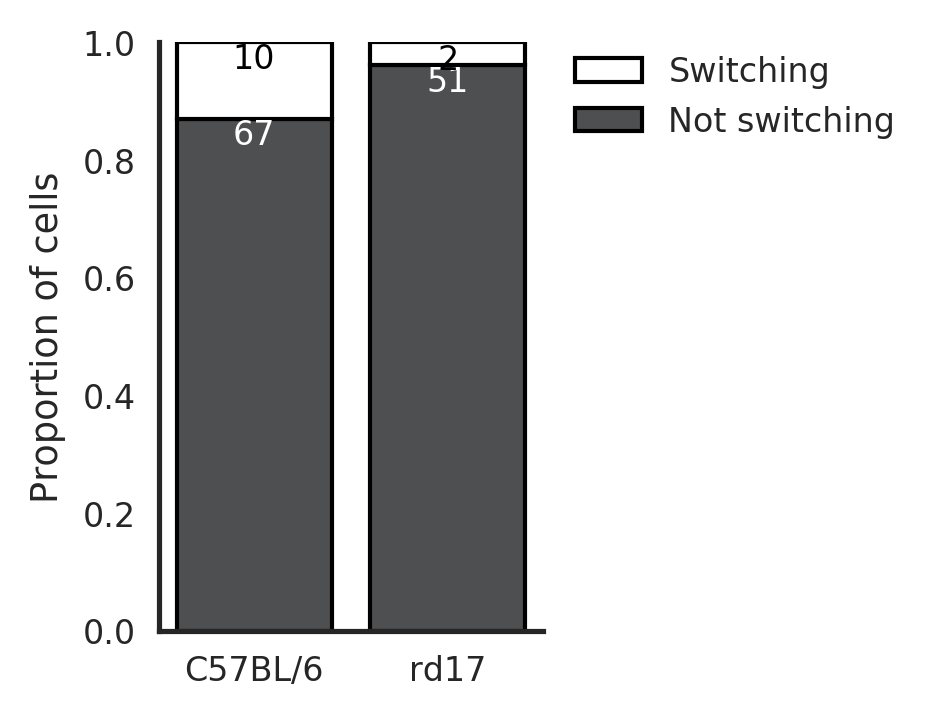
