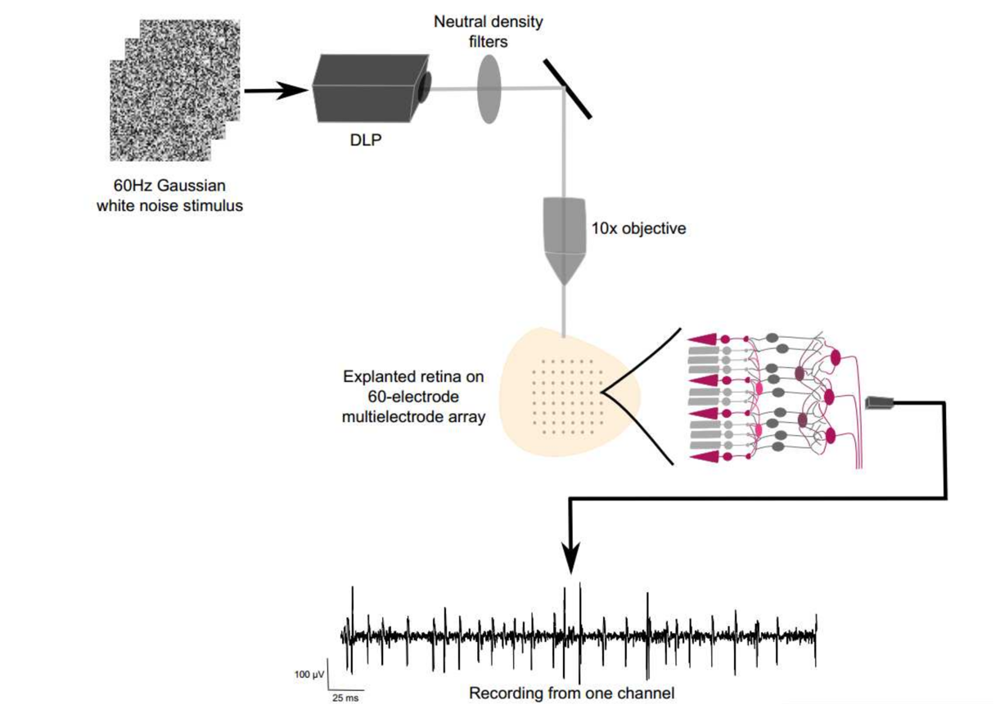
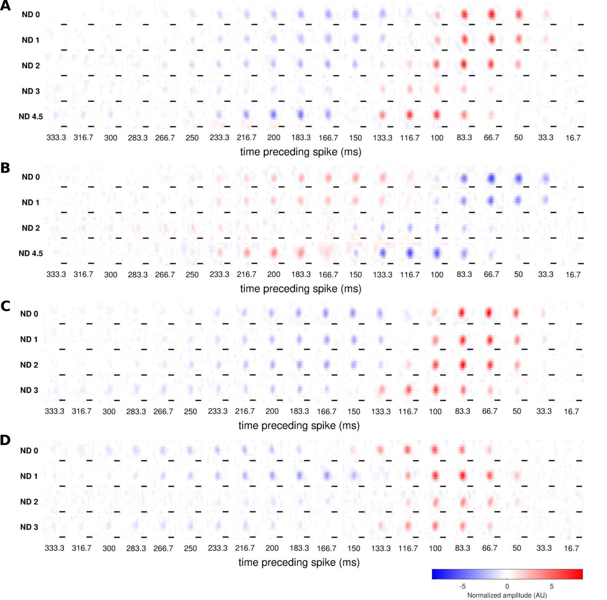
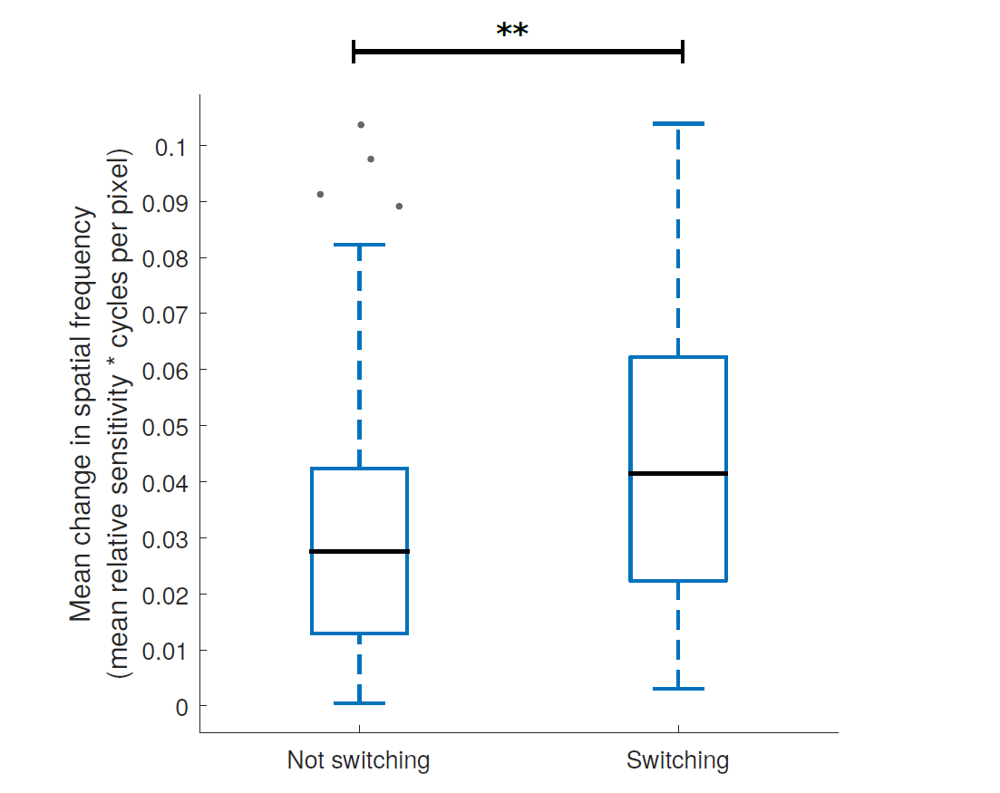

@title[Title slide]
## Lights on, lights off
#### "switching" cells in the reina
Martha Robinson

---?image=figures/retina_circuit.png&size=contain

@title[Introduction to the retina]
Note:
Just keep on to 3 key ideas:
The retina needs to operate and signal meaningfully over a large range of environmental light levels
The retina has two main classes of input cells: rod and cone photoreceptors, that are specialised to dim light and bright light
Rod pathway is "parasitic" on cone pathway via AII cells.
Classically, retina is thought to be separated into ON and OFF channels, is by receptor expression and by anatomy
Give more background on who you are and where you're coming from and what your skills are, and less on making everyone understand the retina.
I started this work because I was interested in how the rod and the cone pathways interact, particularly in "mesopic" vision where both pathways are active, and how this might be altered in disorders of vision where one or other pathway is absent.

---

@title[Methods]


---
@title[Methods]
##### Characterising retinal receptive fields



Note: 
Scalebar is 200um

---

@title[Receptive fields can "switch" with light level]
##### Receptive fields can "switch" with light level


Note:
Scalebar is 200um
Tikidji-Hamburyan (2015) have also seen this
Maybe also point to other egs of switches in ganglion cells

---

@title[Switching occured in 28% of cells]
##### Switching occured in 28% of cells


cite from TK paper (little box figure)

---

@title[Switching in the absence of rod or cone function]
##### Switching in the absence of rod or cone function


---

@title[Switching occured between every pair of light levels]
##### Switching occured between every pair of light levels


---

@title[One cell can switch multiple times]
##### One cell can switch multiple times


---

@title[Switching is associated with spatial instability]
##### Switching is associated with spatial instability




---

@title[Summary]
##### Summary
- Switching was common (28%)
- Swiching occured between every pair of light levels
- One cell can switch multiple times
- Switching is associated with spatial instability

Note:
What mechanism could explain this? 
Why do cells switch polarity?
---

@title[Minmial model of switching]
##### Minimal model of switching

cite from Odermatt 2012 paper

---?image=figures/retina_circuit.png&size=contain

@title[Minimal model of switching]

---

@title[Minimal model of switching]

<p><span class="menu-title slide-title">Test</span></p>

```python
# We also know that cone ON bipolar cells resting membrane potential becomes more hyperpolaized with light, 
# driven by gap junction coupled AII cells (which are in turn driven by rod bipolar cells)
# Define a rectifying terminal where the resting membrane potential hyperpolarizes with light (defined by a Hill function)
def rectifying_terminal_with_gap_junction(vprior, input, dt):
    # inputs: vprior: the membrane potential at the previous timestep
    # input: stimulus input
    # dt: the timestep
    iweight = 0.5 # how much to weight input by for driving excitation
    islope = 20.0 #10.0 # set how steep the slope of the Hill function is
    ih = 5.0 # set half-saturation point of the Hill function
    aslope = 3
    ah = 3
    aweight = 1# how much to weight input by for driving this gap junction voltage
    #calcuate the voltage "input" from antagonistic component (i.e. coupled AII cell)
    antagv = (input*aweight)**-aslope/((input*aweight)**-aslope + ah**-aslope)
    antagweight = 5# how much to scale the 0:1 output of antagv by
    taum = 10 # decay time constant
    # decay the membrane potential back to rest with some constant 
    # and add the input representing excitatory synaptic input
    vinf = (antagv*antagweight) + (input*iweight)
    vt = vinf + (vprior - vinf)*np.exp(-dt/taum)
    # calculate release using Hill equation (sigmoidal)
    release = vt**islope/(vt**islope + ih**islope)
    # return release directly, as bipolar ribbon synapses are graded
    return vt, release
```

---
@title[Minimal model of switching]
#### Minimal model of switching
A **rectifying terminal** that **hyperpolarizes with light**


---

@title[Minimal model allows switching between any pair of light levels]

---
@title[Minimal model allows one cell to switch multiple times]

----
@title[Model summary]
##### Summary
- Switching was common (28%) ✅
- Swiching occured between every pair of light levels ✅
- One cell can switch multiple times ✅
- Switching is associated with spatial instability

---
@title[Next steps]
##### Next steps


---

@title[Questions?]
##### Questions?


