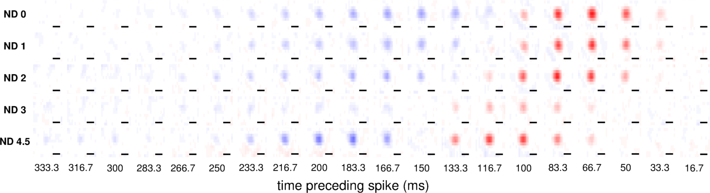
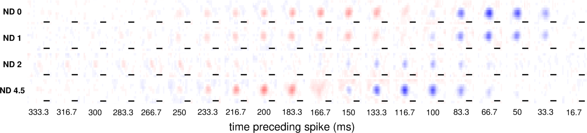
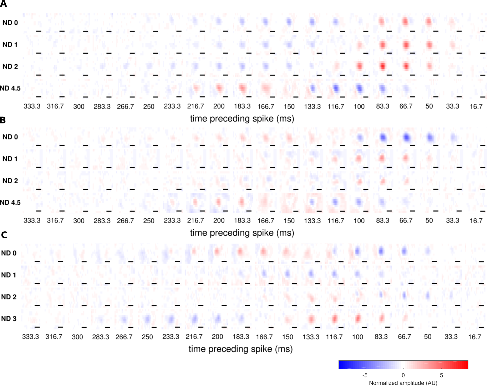

@title[Title slide]
## Lights on, lights off
#### "switching" cells in the reina
Martha Robinson
---

@title[Introduction to the retina]

## Overview of the retina

+++?image=figures/retina_circuit.png&size=contain
<!-- .slide: data-background-transition="none" -->
+++?image=figures/retina_circuit.png&size=contain
<!-- .slide: data-background-transition="none" -->
+++?image=figures/retina_circuit.png&size=contain
<!-- .slide: data-background-transition="none" -->
+++?image=figures/retina_circuit.png&size=contain
<!-- .slide: data-background-transition="none" -->
+++?image=figures/retina_circuit.png&size=contain
<!-- .slide: data-background-transition="none" -->

Note:
Just keep on to 3 key ideas:
The retina needs to operate and signal meaningfully over a large range of environmental light levels
The retina has two main classes of input cells: rod and cone photoreceptors, that are specialised to dim light and bright light
Rod pathway is "parasitic" on cone pathway via AII cells.
Classically, retina is thought to be separated into ON and OFF channels, is by receptor expression and by anatomy

---

@title["On" and "OFF" cells]
#### ON and OFF cells

---

@title[Some cells switch polarity]
###### Some cells switch response polarity

---

@title[Switching was common]

---

@title[Switching occurs between every possible pair of light levels]

---

@title[Switching can occur multiple times in one cell]

---

@title[Cells which switched polarity had less stable spatial receptive fields]

---

@title[Summary of obervsations and questions]

---

@title[Minmial model of switching]

---

@title[Does switching require rod input?]

---

@title[Summary and conclusions]
