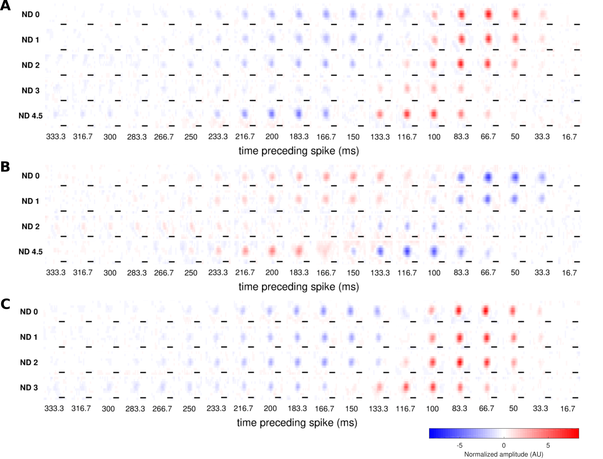
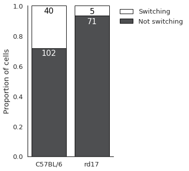

@title[Title slide]
## Lights on, lights off
#### "switching" cells in the reina
Martha Robinson
---

@title[Introduction to the retina]

## Overview of the retina

+++?image=figures/retina_circuit.png&size=contain
<!-- .slide: data-background-transition="none" -->
+++?image=figures/retina_circuit.png&size=contain
<!-- .slide: data-background-transition="none" -->
+++?image=figures/retina_circuit.png&size=contain
<!-- .slide: data-background-transition="none" -->
+++?image=figures/retina_circuit.png&size=contain
<!-- .slide: data-background-transition="none" -->
+++?image=figures/retina_circuit.png&size=contain
<!-- .slide: data-background-transition="none" -->

Note:
Just keep on to 3 key ideas:
The retina needs to operate and signal meaningfully over a large range of environmental light levels
The retina has two main classes of input cells: rod and cone photoreceptors, that are specialised to dim light and bright light
Rod pathway is "parasitic" on cone pathway via AII cells.
Classically, retina is thought to be separated into ON and OFF channels, is by receptor expression and by anatomy

---

@title[Methods]
##### Characterising retinal receptive fields

Note: 
Scalebar is 200um

---

@title[Some cells switch polarity]
##### Receptive fields can "switch" with light level

Note:
Scalebar is 200um
Tikidji-Hamburyan (2015) have also seen this

---

@title[Switching occured in 28% of cells]
##### Switching occured in 28% of cells

---

@title[Switching occured between every pair of light levels]
##### Switching occured between every pair of light levels

---

@title[One cell can switch multiple times]
##### One cell can switch multiple times

---

@title[Switching is assocaited with spatial instability]
##### Switching is assocaited with spatial instability

---

@title[Summary]
##### Summary
- Switching was common (28%)
- Swiching occured between every pair of light levels
- One cell can switch multiple times
- Switching is assocaited with spatial instability

##### What mechanism could explain this? 
##### Why do cells switch polarity?
---

@title[Minmial model of switching]
##### Minimal model of switching

---

@title[Minimal model of switching]

---
@title[Minimal model of switching]

---

@title[Model summary]
##### Summary
- Switching was common (28%)  :white_check_mark:
- Swiching occured between every pair of light levels  :white_check_mark:
- One cell can switch multiple times  :white_check_mark:
- Switching is assocaited with spatial instability

---

@title[Does switching require rod input?]

---

@title[Summary and conclusions]
