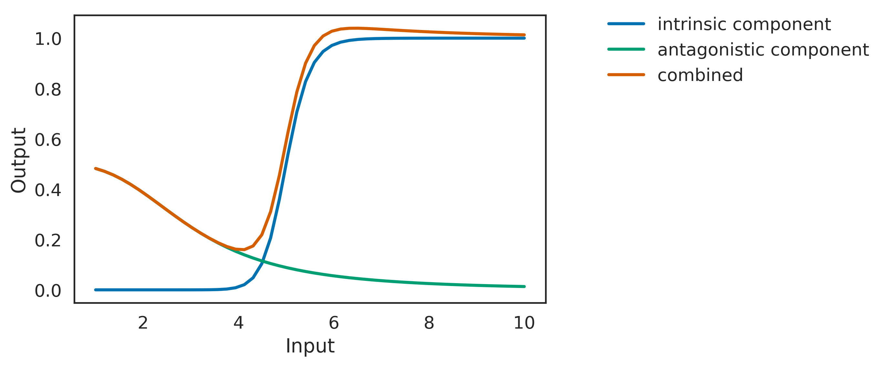

@title[Title slide]
## Lights on, lights off
#### "switching" cells in the retina
Martha Robinson


---?image=figures/retina_circuit.png&size=auto 90%

@title[Introduction]
Note:
You do this amazing feat every day of being able to see in incredibly dim light, and also in really bright light. We work with models of disorders of vision where people struggle to do that.
Give more background on who you are and where you're coming from and what your skills are, and less on making everyone understand the retina.
I started this work because I was interested in how the rod and the cone pathways interact, particularly in "mesopic" vision where both pathways are active, and how this might be altered in disorders of vision where one or other pathway is absent.
Rod pathway is "parasitic" on cone pathway via AII cells.
Classically, retina is thought to be separated into ON and OFF channels, is by receptor expression and by anatomy. Mglur6 On, ionotropic off.

---?image=figures/experimental_outline.png&size=auto 85%

@title[Methods]

Note:
60Hz white noise movies
Project onto retina through a series of neutral density filters - keep contrast the same, but cut down absolute light levels/environmental light levels
Extracellular recordings from ganglion cells using a multielectrode array
Use the resultant spike trains and stimulus movies to generate spatiotemporal spike triggered averages

---?image=figures/NoSwitchcellegs_WT.png&size=auto 90%
@title[Characterising retinal receptive fields]

Note:
Scalebar is 200um
Shown are the same 3 cells at different light levels
Each pixel represents deflection from the mean background pixel (white, as white noise)
Each timestep is the mean frame that preceeded a spike that many ms before the spike
Everything is zscore normalized for presentation (to have 0 mean and unit std), and scaled to the minimum and maximum values I saw, respectively.

---?image=figures/WT_ONOFF_SwitchingCells_EgFilters.png&size=auto 90%
@title[Receptive fields can "switch" with light level]

Note:
So, while I was doing this work, looking at mesopic vision in wild types vs our disease models, I saw something that was initially quite upsetting. My carefully spike sorted single units weren't looking like I'd expected them to. Their receptive fields seemed to change as the light levels changed. Even to the point where they would go from looking like and ON cell too looking like and OFF cell.
Scalebar is 200um
Shown are the same 3 cells at different light levels
Each pixel represents deflection from the mean background pixel (white, as white noise)
Each timestep is the mean frame that preceeded a spike that many ms before the spike
Everything is zscore normalized for presentation (to have 0 mean and unit std), and scaled to the minimum and maximum values I saw, respectively.

---

@title[Switching occurred in over 20% of cells]
<p><span class="menu-title slide-title">Switching occurred in over 20% of cells</span></p>


Note:
This behaviour was very common.
Probably the tip of the iceberg, because being an average the STA can only show a switch when the other/"extra" component (as reported by TH) becomes dominant over and "wins".
Scalebar is 200um
Tikidji-Hamburyan (2015) have also seen this
They say: Overall, 89% of the OFF cells changed their responses at least once between ND8 and ND4. And over 50% of the cells they identified as ON did the same.
Maybe also point to other egs of switches in ganglion cells
They patched anatomically identified ON and OFF cells and showed that this phenomenon is happening in anatomically classic ON cells and OFF cells, not only ON-OFF cells.

---

@title[Switching occurred between every pair of light levels]
<p><span class="menu-title slide-title">Switching occurred between every pair of light levels</span></p>


Note:
Switching occurred between every pair of light levels, without a clear pattern. It's not something as straightforward as a change that happens at cone threshold, for example. Although I was most likely to see a switch when comparing my lowest and my highest light levels.

---

@title[One cell can switch multiple times]
<p><span class="menu-title slide-title">One cell can switch multiple times</span></p>


Note:
Additionally, retinal ganglion cells could switch more than once. Eg. going from ON to OFF to back again. Given I was only using 5 light levels in these experiments (i.e. an opportunity to switch 4 times maximum) this is particularly impressive and again suggests that switching is common (if I can see so much of it when I should be undersampling it). It also suggests that there's not necessarily one event that occurs as the light level increases or decreases that defines a switch - it's something that can happen between multiple light levels within one ganglion cell.

---

@title[Switching is associated with spatial instability]
<p><span class="menu-title slide-title">Switching is associated with spatial instability</span></p>


Note:
Finally, I saw that switching was associated with spatial instability. I had ganglion cells with receptive fields that changed their spatial properties with light level, and these cells were more likely to also exhibit a polarity switch. Suggests this is something that is not affecting all the subunits that combine to make a ganglion cell RF equally.

---

@title[Summary]
#### Summary

- Switching was common
- Switching occurred between every pair of light levels
- One cell can switch multiple times
- Switching is associated with spatial instability

Note:
So, to summarise.
So, having seen this phenomenon in my data, I got quite invested in trying to explain it.
What mechanism could explain this?
Why do cells switch polarity?
Really talk about how this seems like a nightmare for downstream neurons - if they care about polarity at all, how do they cope with their input neurons changing polarity seemingly willy-nilly? Can this switching encode something? If not, what does that mean for how we understand retinal encoding?

---

@title[Switching also occurs at bipolar cell terminals]
<p><span class="menu-title slide-title">Switching also occurs at bipolar cell terminals</span></p>

<br/>


Note:
So, switching between functional ON and OFF responses with light levels has also been reported in bipolar cell terminals of fish, and in starburst amacrine cells in mouse through a mechanism that depends on a ON bipolar cell. It's perfectly possible that there are multiple points where switching occurs in the retina, and that bipolar terminal switches don't explain all ganglion cell switches, but if we're looking for some kind of minimal model, it should be able to explain bipolar cell switching too.
Odermatt = calcium indicator in bipolar cell terminals - SYGCAMP2 in zebrafish
Vlasits = Individual voltage clamp sweeps at −72 mV holding potential showing the excitatory current during presentation of a 2 s light flash (yellow bar) in an On-SAC before and after repetitive stimulation. Light adaptation causes a switch in the starburst amacrine cell, which is blocked by L-AP4 and therefore driven by an ON bipolar cell.

---

@title[Minimal model of switching]
<p><span class="menu-title slide-title">Minimal model of switching</span></p>


<br/>


Note:
To make any cell switch it's receptive field, very simply you need two components that oppose eachother, where sometimes one "wins" and sometimes another "wins" -- or, two components that combine to form a nonlinearity that describes your switch.
Odermatt et al., proposed this basic model of an intrinsic and antagonistic nonlinearity combinining to make a switching terminal. I suggest a biological basis for it: intrinsic is the rectifying bipolar cell terminal, described by Hill sigmoid (often used to v simply model the calcium channels here), and the antagonistic is the bipolar membrane potential, which drifts in opposition to the photoreceptor cell driven bipolar responses.
Grimes et al have already shown that this drift can cause a change in spatial encoding at ganglion cells, due to rectification at the bipolar cell terminal - essentially, switching could be just a form of rectification.

---

@title[Minimal model of switching]
<p><span class="menu-title slide-title">Minimal model of switching</span></p>
```python
def rectifying_terminal_with_gap_junction(
        vprior, input, dt):
    iweight = 0.5 #input weight
    islope = 20.0 #rectifying terminal Hill slope
    ih = 5.0 #rectifying terminal half-saturation point
    aweight = 1.0 #"gap junction" weight
    aslope = 3.0 #Vm Hill slope
    ah = 3.0 # Vm half-saturation point
    vmweight = 5.0 #scale Vm
    taum = 10.0 #decay time constant
    #weight input for "gap junction"
    gi = input*aweight
    #calcuate the Vm set by "gap junction"
    vm = gi**-aslope/(gi**-aslope + ah**-aslope)
    #and add the input
    vinf = (vm*vmweight) + (input*iweight)
    #decay the membrane potential back to vm
    vt = vinf + (vprior - vinf)*np.exp(-dt/taum)
    #calculate release using Hill equation (sigmoidal)
    release = vt**islope/(vt**islope + ih**islope)
    #return graded release directly
    return vt, release
```
@[13,14](Resting membrane potential hyperpolarizes with light)
@[15-18](Terminal depolarizes with input, and decays back to Vm like a leaky IF cell)
@[19-22](Release is nonlinearly dependent on volatage)

Note:
So, I made a very toy basic model of this, to test what's possible with this very simple, two-componet model. Can we generate switching? Can this model recapitualte the data, or do we need extra components to explain what we see?

---

@title[Minimal model of switching]
<p><span class="menu-title slide-title">Minimal model of switching</span></p>


Note:
Rectifying terminal w/o membrane potential drift doesn't switch. Saturates.
When you add resting membrane potential hyperpolarization, switching occurs. You can also see that the dynamic range of the terminal is being made better use of, suggesting that "switching" might serve a purpose of increasing the contrast range a terminal can reliably detect/respond to.

---?image=figures/model_switching_between_diff_lightlevels.png&size=auto 90%

@title[Minimal model allows switching between any pair of light levels]

Note:
Early stages, but as proof of principle. Just adjusting one parameter of the minimal model - here ah, the half saturation point for the "antagonistic" nonlinearity, you can make otherwise identical "terminals" switch at different stimulus intensities. Proof of principle that these two components are theoretically sufficient.

---
@title[Minimal model allows one cell to switch multiple times]


Note:
Again, as proof of principle, this minimal model can also switch more than once, just with these two components.

---
@title[Model summary]
#### Is the model sufficient?

- Switching was common |
- Switching occurred between every pair of light levels |
- One cell can switch multiple times |
- Switching is associated with spatial instability |

Note:
Common - widespread, basic retinal circuit
Occurred between every pair of light levels- small differences in one component can shift switch along light levels
Could occur multiple times in one cell- model terminals can switch multiple times
Associated with spatial instability- likely, as multiple terminals make up spatial receptive field of ganglion cells

---
@title[Ongoing]
#### Ongoing work

* Balance of ON and OFF responses within each cell at each light level - STC analysis

* Extending minimal model into spatial dimensions

* Do bipolar cell terminals also switch in the mouse retina?
    - Looking al light responses in bipolar cell terminals in mouse inner retina using GCAMP6 across different light light levels


Note:
7m8 capsid, GCAMP6 under GRM6 promotor
Gap junction blocker eg meclofenamic acid (MFA) (or connexin 36 knockout)
Glycine blocker eg strychnine

---
@title{Acknowledgements}
#### Acknowledgements
Dr Kate Powell
Dr Matteo Rizzi

Dr Mark Basche
Dr Sander Smith
Dr Sungho Hong
Professor Robin Ali


---

@title[Questions?]
### Questions?

---

@title[Supplementary: Switching in the absence of rod or cone function]
<p><span class="menu-title slide-title">Switching in the absence of rod or cone function</span></p>


---?image=figures/light_levels.png&size=auto 90%
@title[Supplemenary: Light levels]
